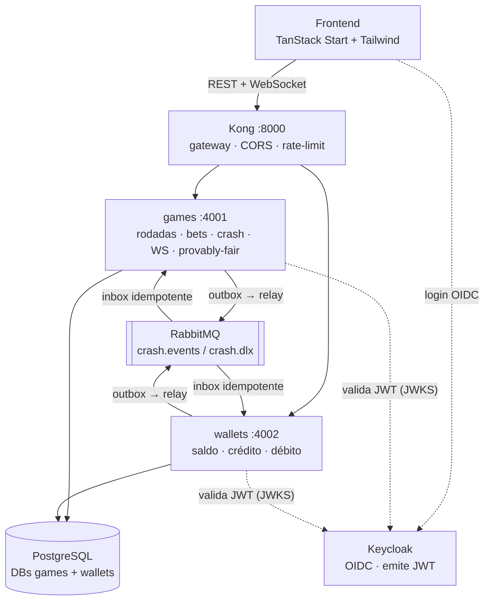
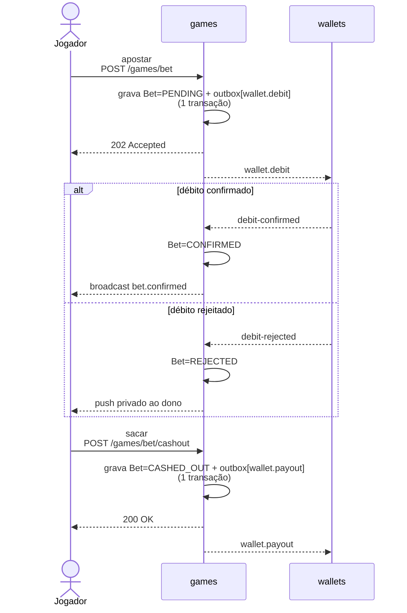

# Crash Game 🎮

[](https://github.com/Jonserafim7/fullstack-challenge/actions/workflows/ci.yml)

Implementação do desafio **Crash Game** da Jungle Gaming. O enunciado — regras do jogo, contrato da
API, infraestrutura e critérios de avaliação — está preservado em
[`docs/CHALLENGE.md`](./docs/CHALLENGE.md).

> Este README assume o enunciado como conhecido e **não o repete**. Ele cobre só o que importa para
> avaliar a entrega: como rodar, a arquitetura construída e as decisões por trás dela (com os
> trade-offs). O "porquê" detalhado de cada decisão vive nos [ADRs](#decisões-de-arquitetura-adrs-).

---

## Como rodar 🐳

```bash
bun install
bun run docker:up      # sobe infra + serviços + frontend — comando único, zero passos manuais
```

Um único `docker:up` cumpre o requisito de "subir tudo sem passo manual": importa o realm do
Keycloak, **aplica as migrations antes de cada serviço subir** (`db:deploy` no `CMD` do Dockerfile),
carrega a config declarativa do Kong, **semeia a carteira do usuário de teste com saldo**, e ordena
o boot com `healthcheck` + `depends_on: condition: service_healthy`.

- 🎮 Jogo: **http://localhost:3000**
- 🔌 API (via Kong): **http://localhost:8000** · Swagger por serviço em `:4001/docs` e `:4002/docs`
- 👤 Login: `player` / `player123` (carteira já com **R$ 1.000,00**; há um `player2` para testar duas abas)
- `bun run docker:down` para parar · `bun run docker:prune` para limpar volumes e imagens

---

## Stack escolhida 🧰

Entre as opções aceitas pelo desafio, as escolhas foram: **Prisma** (ORM, em modo _engine-free_),
**RabbitMQ** (broker), **Kong** (gateway), **Keycloak** (IdP), e **TanStack Start** (SPA) com
**Zustand** + **TanStack Query** no frontend. O motivo de cada uma está nos ADRs abaixo.

O Kong também aplica **rate limiting** por IP (plugin `rate-limiting`, policy `local` para o modo
DB-less): 600 req/min no games (read-heavy: hidratação, histórico e o upgrade do WebSocket) e 300
req/min no wallets; acima disso o gateway responde `429`. Os limites são generosos de propósito, para
acomodar clientes de polling sem deixar de barrar abuso.

---

## Arquitetura entregue 🏗️

Dois _bounded contexts_ NestJS — **games** e **wallets** — cada um com as camadas de DDD
(Domain-Driven Design) estritamente separadas: `domain → application → infrastructure → presentation`.
O que foi **projetado** aqui é a ligação entre os serviços: eles **só** se comunicam de forma
assíncrona pelo RabbitMQ (outbox → relay → inbox idempotente), nunca por chamada direta.



### A saga de aposta (o ponto central da avaliação)

A aposta é uma **saga otimista** com garantias de entrega ([ADR-0001](./docs/adr/0001-async-games-wallets-integration.md),
[ADR-0008](./docs/adr/0008-messaging-implementation.md)):



- **Débito na aposta** (não na liquidação); **cash out é autoritativo no games** — o servidor trava
  o multiplicador no instante do request, então latência do wallets nunca custa um saque válido.
- **Outbox transacional** nos dois lados: o efeito de domínio e a mensagem a publicar commitam
  juntos; um relay por polling drena para o broker. Nada é publicado sem ter sido gravado.
- **Inbox idempotente**: uma redelivery colide na chave primária (`debit:{betId}`, `payout:{betId}`…)
  e vira no-op — o dinheiro se move uma vez (_at-least-once_ na entrega, _exactly-once_ no efeito).
- **Retry com backoff exponencial** via delay-queue e **dead-letter** (`crash.dlx`) para mensagens veneno.
- **Compensação**: um bet anulado (`VOIDED`) cujo débito chega atrasado dispara um `wallet.refund`.

### Os dois designs "ao vivo" também avaliados

- **Tempo real** — WebSocket só server→client, emitindo **apenas eventos de fase**; o multiplicador
  é função determinística do tempo recomputada no cliente, não um stream de ticks. Catálogo de
  eventos, payloads e estratégia de sincronização: [ADR-0003](./docs/adr/0003-realtime-synchronization.md).
- **Provably fair** — hash chain SHA-256 com _commitment_ publicado antes das rodadas; o endpoint
  `GET /games/rounds/:n/verify` revela o seed e o frontend **recalcula a verificação no próprio
  navegador**: [ADR-0002](./docs/adr/0002-provably-fair-crash-point.md).

---

## Decisões de arquitetura (ADRs) 🧠

Um **ADR** (Architecture Decision Record) é um documento curto que registra **uma** decisão
arquitetural significativa: o **contexto** que a motivou, a **decisão** tomada e suas
**consequências** (os trade-offs). Eles tornam o "porquê" rastreável — dá para reconstruir o
raciocínio sem ler todo o código. Ficam em [`docs/adr/`](./docs/adr/).

- **[ADR-0001 — Integração assíncrona games↔wallets](./docs/adr/0001-async-games-wallets-integration.md)**
  Modela a aposta como saga otimista (débito na aposta, cash out autoritativo, compensação por
  refund). _Trade-off:_ mais peças (outbox/inbox/DLQ) em troca de desacoplamento real e nenhum
  dinheiro perdido sob falha.
- **[ADR-0002 — Geração do crash point provably fair](./docs/adr/0002-provably-fair-crash-point.md)**
  Hash chain SHA-256 com commitment + crash point via HMAC; seed revelada após o crash. _Trade-off:_
  pré-gerar a chain custa memória/boot em troca de comprometimento à prova de manipulação.
- **[ADR-0003 — Sincronização em tempo real](./docs/adr/0003-realtime-synchronization.md)**
  Servidor emite só transições de fase; o multiplicador é `m(t)` recomputado no cliente via
  `requestAnimationFrame`. _Trade-off:_ zero flood de rede e a mesma curva em todos os clientes, ao
  custo de exigir a fórmula nos dois lados (drift visual é aceitável — o dinheiro é decidido no servidor).
- **[ADR-0004 — Representação de dinheiro](./docs/adr/0004-money-representation.md)**
  Centavos inteiros (`bigint`) no value object `Money`; multiplicador em centésimos; payout por
  aritmética inteira com `floor`. _Trade-off:_ mais verboso que `number`, mas a exatidão vira
  propriedade do tipo (critério eliminatório).
- **[ADR-0005 — ORM: MikroORM](./docs/adr/0005-orm-mikroorm.md)** _(substituído pelo 0007)_
  Escolha inicial de ORM, mantida como registro histórico. A troca barata depois validou a decisão
  de isolar o ORM atrás do repository pattern.
- **[ADR-0006 — Arquitetura do frontend](./docs/adr/0006-frontend-architecture.md)**
  TanStack Start (SPA); TanStack Query para REST + Zustand para o estado ao vivo do WS; multiplicador
  fora do React (canvas + rAF); token OIDC **em memória** com silent renew. _Trade-off:_ re-hidratar
  via silent renew em troca de auth segura contra XSS e 60fps sem re-render.
- **[ADR-0007 — Persistência com Prisma](./docs/adr/0007-persistence-with-prisma.md)** _(substitui o 0005)_
  Prisma 7 _engine-free_ atrás do mesmo repository pattern; domínio livre de ORM, mapeamento
  explícito. _Trade-off:_ um pouco de boilerplate de mapper em troca de uma camada inspecionável e de
  build confiável sob Bun/alpine.
- **[ADR-0008 — Implementação da mensageria](./docs/adr/0008-messaging-implementation.md)**
  Cliente RabbitMQ, outbox transacional, inbox idempotente, retry/DLQ. _Trade-off:_ concretiza as
  garantias do ADR-0001 — a complexidade necessária para entrega confiável.

---

## Testes 🧪

```bash
bun run test:unit                          # unidade do backend (domínio + use cases)
cd frontend && bun test                    # unidade/componente do frontend
cd frontend && bun run check               # lint + typecheck do frontend
bun run docker:up:e2e                       # sobe o stack com cenário de crash determinístico
cd services/games && bun test tests/e2e    # E2E pela API real (via Kong)
```

**103 testes de unidade** no backend cobrem o ciclo de vida e as invariantes do Round, a máquina de
status do Bet, a Wallet (incl. saldo insuficiente e precisão), o provably fair (derivação +
verificação da chain) e a mensageria (dedup do inbox, retry policy); **17 no frontend** cobrem
parsing/validação de aposta, as derivações do painel, as stores e os formatadores. Os **E2E**
exercem, ponta a ponta via Kong: aposta→confirmação→débito, aposta→saque→crédito, saldo insuficiente
(rejeição pelo broker, sem mover dinheiro), crash→perda e presença ao vivo no WebSocket.

O E2E é **determinístico** via `docker-compose.e2e.yml` (crash points roteirizados por
`CRASH_SCENARIO`), e um **CI** (GitHub Actions) roda lint + typecheck + unidade a cada push/PR.

---

## Extras (bônus do desafio) ⭐

- **Outbox/Inbox transacional** — _at-least-once_ na entrega, _exactly-once_ no efeito ([ADR-0008](./docs/adr/0008-messaging-implementation.md)).
- **Verificação provably-fair no navegador** — o cliente recalcula o crash point sem confiar no servidor.
- **Rate limiting** no Kong (per-IP, `429` acima do limite).
- **CI** (GitHub Actions) rodando lint + typecheck + testes a cada push/PR.
- **Seed determinística para E2E** — `docker-compose.e2e.yml` roteiriza crash points reproduzíveis.

---

## Mapa do repositório 🗺️

| Onde | O quê |
| ---- | ----- |
| [`docs/CHALLENGE.md`](./docs/CHALLENGE.md) | Enunciado original (fonte da verdade dos requisitos) |
| [`docs/adr/`](./docs/adr/)                 | Decisões de arquitetura (0001–0008) |
| [`CONTEXT.md`](./CONTEXT.md)               | Glossário do domínio (a linguagem ubíqua) |
| [`AGENTS.md`](./AGENTS.md)                 | Guia de contribuição: comandos por serviço, convenções, _gotchas_ |
| `services/games`, `services/wallets`       | Os dois bounded contexts (DDD) |
| `packages/`                                | Código compartilhado: `@crash/money`, `provably-fair`, `crash-curve`, `messaging` |
